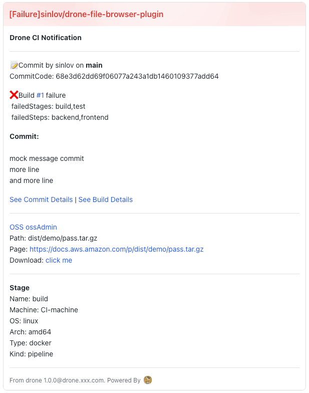

## Features

## [1.6.0](https://github.com/sinlov/drone-feishu-group-robot/compare/v1.5.0...v1.6.0) (2023-02-11)

### Features

* fix Drone.Commit.Link compare not support, when tags Link get error ([c55854a](https://github.com/sinlov/drone-feishu-group-robot/commit/c55854acf74887699b754ff51ef8859937665087))
* update github.com/sinlov/drone-info-tools v1.7.0 and card render by Drone Tag ([6ee3f3c](https://github.com/sinlov/drone-feishu-group-robot/commit/6ee3f3cf01459e68aa97ece2358aed0973d2ff96))

## [1.5.0](https://github.com/sinlov/drone-feishu-group-robot/compare/v1.4.0...v1.5.0) (2023-02-04)

### Features

* let flag bind and maintain at package feishu_plugin ([af68743](https://github.com/sinlov/drone-feishu-group-robot/commit/af687439627de513eb54750241252aa0de0d8b8c))

## [1.4.0](https://github.com/sinlov/drone-feishu-group-robot/compare/v1.3.1...v1.4.0) (2023-02-03)

### Features

* embed package.json to config cli ([911a269](https://github.com/sinlov/drone-feishu-group-robot/commit/911a26938ce2e81aae62e90d59523e9bb5e5e232))

### [1.3.1](https://github.com/sinlov/drone-feishu-group-robot/compare/v1.3.0...v1.3.1) (2023-02-03)

- failure notification by build success but oss status error

### Bug Fixes

* add feishu_oss_info_send_result and fix template render init func ([affd62f](https://github.com/sinlov/drone-feishu-group-robot/commit/affd62f18aae34fb7d4b6ea3c7715de043847f1c))
* fix not set oss will show drone build error ([9427ed8](https://github.com/sinlov/drone-feishu-group-robot/commit/9427ed8b45a4f67df5da87cee8caa72763538b7b))

## [1.3.0](https://github.com/sinlov/drone-feishu-group-robot/compare/v1.2.0...v1.3.0) (2023-02-03)

### Features

* change to use github.com/sinlov/drone-info-tools v1.2.0 and remove useless code ([b00f07e](https://github.com/sinlov/drone-feishu-group-robot/commit/b00f07e93d2f484a0bbac666185ca2af6f9ec465))

### v1.2.0

- failure notification

- success notification

### v1.1.0

- success

- failure

